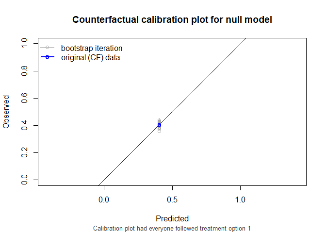
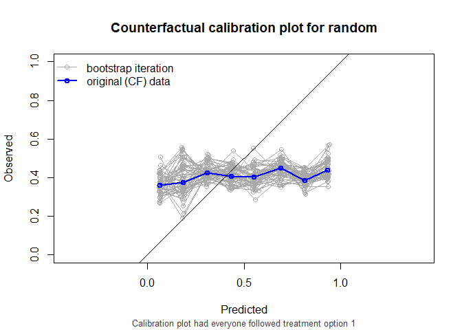
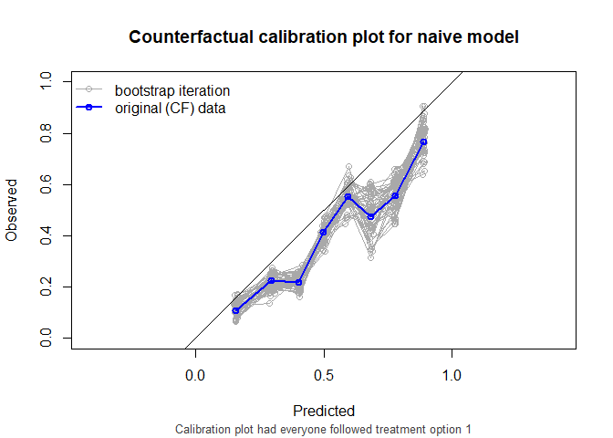
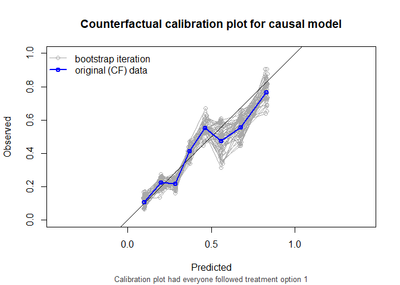

<!-- README.md is generated from README.Rmd. Please edit that file -->

# ipeval <!-- badges: start --> <!-- badges: end -->

Provides methods to evaluate predictive performance of models that
estimate risks under hypothetical intervention scenarios
(interventional/causal/counterfactual predictions) with observational
data. Inverse probability of treatment weighting (IPTW) is used to
construct a pseudopopulation in which all individuals receive a
specified intervention, enabling assessment of agreement between
predicted risks and observed outcomes under that intervention. Supports
binary and time-to-event outcomes under binary interventions, with
performance measures including AUC, Brier score, observed-expected
ratio, and calibration plots. Methods implemented in this pacakge are
based on work by [Keogh and Van Geloven
(2024)](https://doi.org/10.1097/EDE.0000000000001713).

## Installation

The development version of ipeval can be installed from
[GitHub](https://github.com/) with:

``` r
# install.packages("devtools")
devtools::install_github("jvelumc/ipeval")
```

``` r
library(ipeval)
```

## Usage

To demonstrate package usage, we require data and prediction models. We
simulate data for binary outcome $Y$ and point treatment $A$, with the
relation between $A$ and $Y$ confounded by variable $L$. Variable $P$ is
a prognostic variable for only the outcome. The treatment reduces the
risk on a bad outcome ($Y = 1$) in this example.

<figure>

<figcaption aria-hidden="true">Figure 1. DAG for toy
example</figcaption>
</figure>

``` r
simulate_data <- function(n, seed) {
  data <- data.frame(id = 1:n)
  data$L <- rnorm(n)
  data$A <- rbinom(n, 1, plogis(2*data$L))
  data$P <- rnorm(n)
  data$Y <- rbinom(n, 1, plogis(0.5 + data$L + 1.25 * data$P - 0.9*data$A))
  data
}

df_dev <- simulate_data(n = 2000, seed = 1)
```

We will create a couple of prediction models using the development data.

``` r
# naive model, not accounting for confounding variable L
naive_model <- glm(Y ~ A + P, family = "binomial", data = df_dev)

# causal model, accounting for L by IP-weighting
trt_model <- glm(A ~ L, family = "binomial", data = df_dev)
propensity_score <- predict(trt_model, type = "response")
df_dev$iptw <- 1 / ifelse(df_dev$A == 1, propensity_score, 1 - propensity_score)
causal_model <- glm(Y ~ A + P, family = "binomial", data = df_dev, weights = iptw)
#> Warning in eval(family$initialize): non-integer #successes in a binomial glm!

# a model that randomly predicts something, not very good probably
random_predictions <- runif(5000, 0, 1)
```

``` r
print(coefficients(naive_model))
#> (Intercept)           A           P 
#>  -0.1088558   0.3407801   1.1878727
print(coefficients(causal_model))
#> (Intercept)           A           P 
#>   0.3862409  -0.6863653   1.1949409
```

Both models can generate predictions under treatment (setting $a$ to 1)
and predictions under no treatment ($a$ to 0). If using the predictions
for decision making, according to the naive model, no patient should be
treated, as patients that get treated have a higher risk for the
outcome. The causal model correctly infers that treatment benefits
patients.

We are now interested in how the models perform in an external
validation dataset. This dataset can have a different causal structure
from the original development dataset. In this example, the data is
simulated in the same way.

``` r
df_val <- simulate_data(n = 5000, seed = 2)
```

In validation studies, it is common to leave the data as it is, and
compute the performance metrics on this observed dataset, where some
patients were treated and others were not, and treatment assignment is
dependent on confounders. This package has a convenience function that
can do this, but it is not recommended to use it. For illustration
purposes, we use it here nonetheless.

``` r
observed_score(
  object = list(
    "random" = random_predictions,
    "naive model" = naive_model,
    "causal model" = causal_model
  ),
  data = df_val, 
  outcome = Y,
  metrics = c("auc", "brier", "oeratio")
)
#> 
#>         model   auc brier oeratio
#>        random 0.505 0.331   1.010
#>   naive model 0.764 0.198   0.998
#>  causal model 0.741 0.207   1.001
```

The naive model appears to outperform the causal model. These
performance measures represent the performance of the models under the
treatment assignment strategy present in the validation data. If these
models were to be used for decision-making, the treatment assignment
mechanism would change, and these performance estimates would no longer
be relevant.

For example, the models may be used to inform whether patients should
receive treatment or not. For patients and clinicians, it is then
important to know what their treated risk would be and their untreated
risk. It follows that these treated risks should be accurate compared to
the outcomes patients would get if they were to be treated, and that the
untreated risks should be accurate compared to the outcomes they would
get if left untreated. Thus, the question that we would like to have
answered is the following:

How well does our prediction model perform if we were to treat nobody?
And if we were to treat everybody?

The ipeval package aims to provide tools to answer questions like these.
The main function `ip_score()` can be used for this. This function
estimates several performance measures in a setting where all patients
where counterfactually given the treatment of interest, printing by
default the assumptions required for valid inference. The first argument
is the object to validate. This can be a glm model, a coxph model for
survival data, or a numeric vector corresponding to predicted risks.
Multiple models can be specified for comparison. Other arguments
supplied are the validation data, the observed outcomes, a treatment
formula for which the left hand side denotes the treatment variable and
the right hand side the confounders required to adjust for treatment
assignment, and the hypothetical treatment option for which you want to
know how well the model performs if everyone in the population was
(counterfactually) assigned to that treatment.

If nobody would have been treated:

``` r
ip_score(
  object = list(
    "random" = random_predictions,
    "naive model" = naive_model,
    "causal model" = causal_model
  ),
  data = df_val, 
  outcome = Y,
  treatment_formula = A ~ L, 
  treatment_of_interest = 0
)
#> Estimation of the performance of the prediction model in a
#>  counterfactual (CF) dataset where everyone's treatment A was set to 0.
#> The following assumptions must be satisfied for correct inference:
#> - Conditional exchangeability requires that the inverse probability of
#>  treatment weights are sufficient to adjust for confounding between
#>  treatment and outcome.
#> - Conditional positivity (assess $ipt$weights for outliers)
#> - Consistency (including no interference)
#> - Correctly specified propensity model. Estimated treatment model is
#>  logit(A) = -0.07 + 2.05*L. See also $ipt$model
#> 
#>         model   auc brier oeratio
#>    null model 0.500 0.245    1.00
#>        random 0.496 0.335    1.14
#>   naive model 0.766 0.204    1.20
#>  causal model 0.766 0.196    1.00
```


And similarly, we can assess performance if everybody would have been
treated. It is also possible to get confidence intervals around the
performance metrics with bootstrapping:

``` r
ip_score(
  object = list(
    "random" = random_predictions,
    "naive model" = naive_model,
    "causal model" = causal_model
  ),
  data = df_val, 
  outcome = Y,
  treatment_formula = A ~ L, 
  treatment_of_interest = 1,
  quiet = TRUE,
  bootstrap = 50,
  bootstrap_progress = FALSE
)
#> 
#> auc
#> 
#>         model   auc lower upper
#>    null model 0.500 0.500 0.500
#>        random 0.533 0.498 0.575
#>   naive model 0.739 0.704 0.780
#>  causal model 0.739 0.704 0.780
#> 
#> brier
#> 
#>         model brier lower upper
#>    null model 0.241 0.235 0.246
#>        random 0.314 0.292 0.335
#>   naive model 0.218 0.199 0.233
#>  causal model 0.202 0.186 0.218
#> 
#> oeratio
#> 
#>         model oeratio lower upper
#>    null model   1.000 0.925 1.066
#>        random   0.812 0.752 0.869
#>   naive model   0.751 0.697 0.800
#>  causal model   0.930 0.863 0.988
```



The causal model has better calibration and Brier score for these
settings. Note that the AUC of the naive model and the causal model are
equal. AUC is driven entirely by how individuals’ model predictions are
ranked, not by the magnitude of the predictions. In this simple setting,
P is the only variable driving prognostic differences between
individuals (in a pseudopopulation where we counterfactually set
everyone’s treatment status to $0$). While the models have different
coefficients for P, individuals are ranked in exactly the same way.

`ip_score()` also supports stabilized weights and bootstrapping for
confidence intervals around performance measures. Right censored
survival data and cox models are also supported.

A more detailed motivation is given in [this
vignette](https://jvelumc.github.io/ipeval/articles/ipeval.html). How to
use this package for survival data is given in [time-to-event
vignette](https://jvelumc.github.io/ipeval/articles/time-to-event.html)
